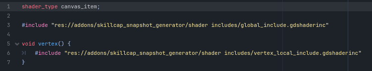

# Godot Snapshot Generator Addon

## Intro
This addon contains a **SnapshotGenerator** node2D class which generates **snapshots*** of 2D elements like canvas groups and sprites at runtime, and stores them into a texture atlas.

## Terminology

* **subject*** - a visual element that a **SnapshotGenerator** is set to capture.
* **snapshot*** - a runtime-generated alpha image of all **subjects*** of a **SnapshotGenerator**.

## In This Addon

* **SnapshotGenerator** node2D class which generates **snapshots*** of 2D elements like canvas groups and sprites at runtime, and stores them into a texture atlas.
* **SnapshotManager** static class which manages all **SnapshotGenerator**s and their **subjects***.
* a **filter.glsl** compute shader file which performs the **snapshot*** generation.
* **Shader Includes** which must be included in the **Material**s of any **SnapshotGenerator**'s **subject**.

## Basic Usage

Add a new **SnapshotGenerator** node to your scene. Choose its `target` which it can automatically follow every frame. 

Set all of its desired **subjects*** in `subjects`. Those can be **CanvasGroup**s or individual **Sprite2D**s.

Make sure that each **subject** has a **ShaderMaterial** that supports **SnapshotGenerator**. To do that, you must include the **shader includes** provided by the addon in this fashion:

*image 1: a minimal example of SnapshotGenerator supporting ShaderMaterial code*

Set the desired global rect that you want to take a **snapshot*** of in `snapshot_rect` (it will be relative to `target`'s global position if the **SnapshotGenerator** is set to follow it).

Set the desired resolution multiplier of the **snapshots*** in `snapshot_resolution_scale` to your needs. Higher values means higher **snapshot*** quality within the same global `snapshot_rect`.

You can have **SnapshotGenerator** save multiple past **snapshots*** through `atlas_dimensions`. This will configure the column and row count of the output **snapshot*** atlas.

At runtime, all you have to do is call `generate_snapshot()` on your **SnapshotGenerator**. This will update its `snapshot_texture` with a new **snapshot***. `generate_snapshot()` will return the atlas frame that the generated **snapshot*** was rendered to, and you can also get it from the **SnapshotGenerator**'s `last_frame_rendered`.

You can then use the **SnapshotGenerator**'s `snapshot_texture` as any ordinary atlas texture across the application.

## Technical Overview

The purpose of this addon is to facilitate the ability to dynamically generate isolated alpha images of visual elements in your scene at runtime, while staying optimized, non-invasive, and capable.

The way **SnapshotGenerator** works is as follows:

On `_ready` it create 2 viewports and 2 cameras, and adds them as its children. 

It then sets both viewport's `world_2d`s to the root scene's `world_2d`, so that they can render it. Otherwise they would render their own `world_2d` and separate scenes.

In addition, **SnapshotGenerator** subscribes itself to **SnapshotManager**, and accepts a unique id from it.

The way the **snapshot*** generation works is that both viewports render the same scene within a defined `snapshot_rect`, but one viewport renders the scene *without* the **subjects***.

These two resulting viewport textures are then used in a compute shader dispatch with **filter.glsl** as the shader.

In **filter.glsl**, I compare the two textures, and write to an equally sized output image all the pixels are different between the two viewport textures based on some epsilon, leaving the rest transparent.

That output texture can be accessed from the **SnapshotGenerator**'s `snapshot_texture`.

Now comes the tricky part, how do I actually make one viewport NOT render the **SnapshotGenerator**'s subjects?

I guess the first question you should ask is why do I use this method in the first place?

This implementation uses viewports because the project does not expose a
simpler path for reading a `CanvasGroup` back-buffer directly.

Ideally I would be able to use the back-buffer generated by a **CanvasGroup** directly, simplifying the process *significantly*, but I could not find anywhere where it said it is even possible.

The next best option is to use viewports. 

Moving all **subjects*** into a separate viewport's `world_2d` is impractical assuming it is even possible.

This leaves me with sharing the same root `world_2d` between the main scene and the **SnapshotGenerator** viewports as the next best and feasible approach.

Now, when it comes to per-viewport visibility in Godot, the options are also quite limited, with the `canvas_cull_mask` and subsequent per-element `visibility_layers` properties being the only facilitated way to do so.

The way those behave is quite limited and I quote *"A Viewport will render a CanvasItem if it and all its parents share a layer with the Viewport's canvas cull mask."*

This means that if I want a single element down the hierarchy to be visible for a viewport using `visibility_layers`, all its parents have to be visible as well.

This alone means that in order to actually isolate an element down the hierarchy I would have to use this two-viewport negative rendering approach, and the limitations don't end there.

Any node that I DON'T want visible would also force all its children to be invisible by the viewport.

There are a few more problems:

First, this takes a whole layer or two away from what the rest of the project can use, meaning its pretty invasive and may not work in some projects.

In addition, there is the issue of multiple **SnapshotGenerator**s that have their `snapshot_rect`s overlapping.

At that point elements that are visible to those viewport would render to both, regardless of which element is which **SnapshotGenerator**'s **subject***, leading to significant potential artifacts in those situations. 

The solution I landed on solves both the `visibility_layer` limitation by requiring no explicit use of them, and the overlapping **SnapshotGenerator**s issue by establishing per-viewport visibility driven by unique **SnapshotGenerator**s id's.

This is the reason that a **SnapshotManager** is needed in the first place, to assign different **SnapshotGenerator**s unique id's.

The core technique is to encode the viewport's id into its **CANVAS_MATRIX**, by manipulating the `zoom` of its camera. In this case, 100th's of pixels in the x axis for the first digit of the **SnapshotGenerator**'s id, and 100's of pixels in the y axis for the second digit.

Then, I can access **CANVAS_MATRIX** from the **ShaderMaterial** of the element, and if it matches the id, I simply scale the element to 0 in the `vertex()` function, making it invisible.

In order to do that, I established the **shader includes** that arrive as part of the addon. It is as simple as including them like shown in *image 1*.

And that is how **SnapshotGenerator**'s **subjects*** don't render to one of the viewport, making the masking possible.

A few notes:

- In order for the masking to work, both **SnapshotGenerator** viewports must be absolutely identical, otherwise any deviation would lead to different color values. this means that since the visibility of a **subject*** is driven by the **CANVAS_MATRIX** of a viewport, by default the **subject***'s material would not distinguish between the two viewports, and would simply not render for both, undermining the entire solution.

    To solve this, I am flipping the zoom for the second viewport's camera, so that its **CANVAS_MATRIX** is negative. This is not a perfect solution, as floating point values are now not the exact same, and it required me to establish an epsilon where otherwise I could equate color values directly, but it works.

- The **SnapshotManager** allows the support of multiple **SnapshotGenerator**s sharing the same **subjects***, this is why it also is in charge of syncing the **Material** uniforms of all **subjects***.

## Limitations

As established in the section above, the **snapshot*** extraction works by extracting the differences between a scene's color with and without the **SnapshotGenerator**'s **subjects***.

The two limitations that arise from that are: 
* If the subject is occluded fully or partially it will not or only partially be captured by the **snapshot***. 
* if a **subject***'s color matches its non-**subject*** background within an epsilon even partially, it will not be capture by the **snapshot*** in those parts, potentially leading to holes in the generated **snapshot***.

In addition, any particularly noisy shader that produces random values based on screen position, directly or indirectly, will increasingly produce artifacts on the final **snapshot***.

As established also above, the **snapshot*** generation works thanks to the surface material of the **subjects*** knowing that it is captured by a **SnapshotGenerator**'s viewport, and making itself automatically invisible.

This means that:
* Every desired **subject*** must have a **ShaderMaterial** and have it modified to include the **shader includes** provided by the addon as described above. 
* No two **subjects*** that are captured by different **SnapshotGenerator**s can share a material resource instance. Either `make_unique` on the **Material** resource of one of them, or if the **subjects*** are instanced into the scene, their **Material**s must have `local_to_scene` enabled.

The snapshot generator is able to be as performant as it is by using the viewport textures directly as uniforms in the compute stage.

For that to work, the viewport textures and the compute dispatch must be on the same rendering device, limiting us to only dispatch on the main rendering device that is accessible with **RenderingServer**.`get_rendering_device()`.

This imposes two limitations:
* The position of the dispatch in the render queue is out of my control, and I cannot `sync()` the code execution to when it is done.
* The `rendering/driver/threads/thread_model` project setting must stay on *Single-Safe* or *Single-Unsafe*.

